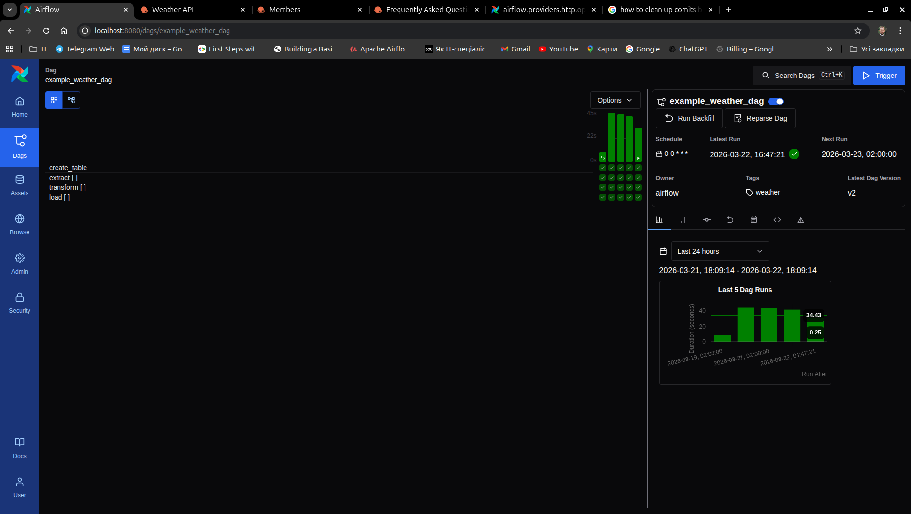
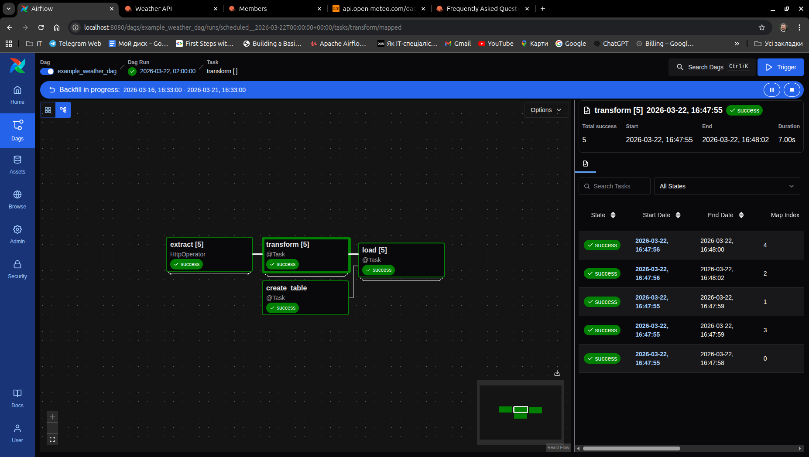
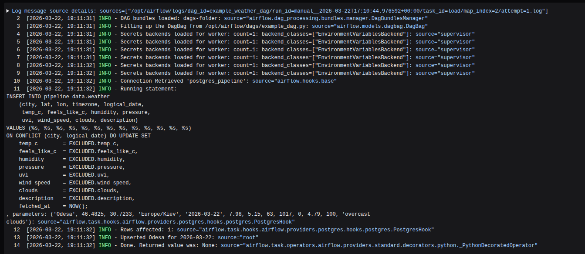
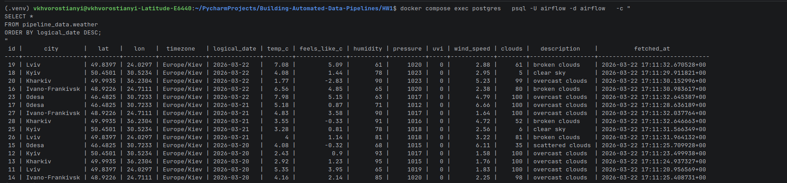

# Homework 1: Airflow 3.0.0 — Docker Compose with CeleryExecutor
---
A minimal, local deployment of **Apache Airflow 3.0.0** using
**Docker Compose** and the **CeleryExecutor**.

---

## Quick Start
```bash
docker compose up --build
```


### Results






### Useful Commands
```bash
docker compose logs -f airflow-scheduler   # view scheduler logs
docker compose down                        # stop all services
docker compose down -v                     # stop + wipe all volumes
```