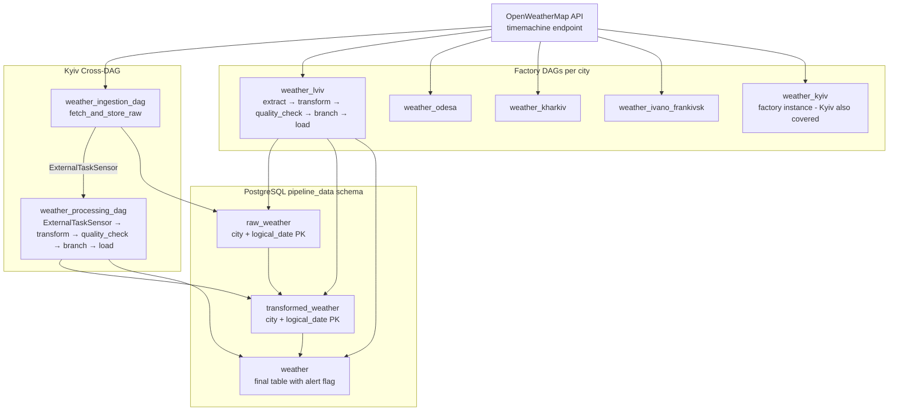

# HW3 — Automated Weather Data Pipeline

## Project Overview

HW3 of the "Building Automated Data Pipelines" course. Implements a production-style weather ingestion and processing pipeline for five Ukrainian cities using Apache Airflow 3.0, PostgreSQL, Redis (Celery), and Docker Compose.

**Rubric requirements met (from `init_spec.md`):**
| Weight | Requirement |
|--------|-------------|
| 20% | Jinja templates — every hardcoded value is a DAG param |
| 30% | Cross-DAG dependencies — `weather_ingestion_dag` → `weather_processing_dag` for Kyiv |
| 50% | Design patterns — factory, data quality gate, staged ETL, idempotent resume |

---

## Architecture



---

## Project Structure

```
HW3/
├── airflow/
│   └── dags/
│       ├── weather_ingestion_dag.py    # Kyiv: fetch raw → raw_weather
│       ├── weather_processing_dag.py   # Kyiv: ExternalTaskSensor → transform → load
│       └── weather_city_factory.py     # Factory: 5 cities (incl. Kyiv), self-contained DAGs
├── docker-compose.yaml                 # Full service topology
├── Dockerfile                          # apache/airflow:3.0.0 base + requirements
├── .env                                # API key, UIDs, secrets (not committed)
├── init_spec.md                        # Original rubric
└── README.md
```

---

## Tech Stack

| Layer | Technology |
|-------|-----------|
| Orchestrator | Apache Airflow 3.0.0 — CeleryExecutor |
| Task queue / broker | Redis 7.2 |
| Metadata DB + pipeline store | PostgreSQL 16 |
| Celery monitoring | Flower (port 5555, optional Docker profile) |
| Weather data source | OpenWeatherMap API — `data/3.0/onecall/timemachine` |
| Container runtime | Docker Compose |
| Python | 3.12 |

---

## Infrastructure Services

| Service | Port | Notes |
|---------|------|-------|
| `airflow-apiserver` | 8080 | FastAPI-based UI — replaces the classic webserver in Airflow 3.0 |
| `airflow-scheduler` | — | DAG scheduling |
| `airflow-dag-processor` | — | Standalone DAG file processor (new in Airflow 3.0) |
| `airflow-worker` | — | Celery worker |
| `airflow-triggerer` | — | Async deferred operator support |
| `postgres` | 5432 | Airflow metadata + `pipeline_data` schema |
| `redis` | 6379 | Celery broker |
| `flower` | 5555 | Celery monitoring — start with `--profile flower` |

---

## Quick Start

```bash
cd HW3

# Set your API key (only needed once)
echo "WEATHER_API_KEY=<your_openweathermap_key>" >> .env

# Initialise the DB, schema, connections, and admin user
docker compose up airflow-init

# Start all services (including Flower monitoring)
docker compose --profile flower up -d

# Airflow UI  → http://localhost:8080   (airflow / airflow)
# Flower      → http://localhost:5555
```

> **Generate Fernet key (recommended before production use):**
> ```bash
> python -c "from cryptography.fernet import Fernet; print(Fernet.generate_key().decode())"
> # Paste result into .env as AIRFLOW__CORE__FERNET_KEY=<value>
> ```

---

## Environment Variables (`.env`)

| Variable | Required | Default | Purpose |
|----------|----------|---------|---------|
| `WEATHER_API_KEY` | **Yes** | — | OpenWeatherMap API key |
| `AIRFLOW_UID` | **Yes** | 1000 | Host UID for Docker volume permissions |
| `AIRFLOW__CORE__FERNET_KEY` | Recommended | empty | Encrypts secrets at rest |
| `AIRFLOW__WEBSERVER__SECRET_KEY` | Yes | `airflow_secret` | Flask session key |
| `AIRFLOW__API_AUTH__JWT_SECRET` | Yes | `airflow_jwt_secret` | Worker → API server auth (Airflow 3.0) |
| `_AIRFLOW_WWW_USER_USERNAME` | Yes | `airflow` | Admin login |
| `_AIRFLOW_WWW_USER_PASSWORD` | Yes | `airflow` | Admin password |

---

## DAG Design Patterns

### 1. Jinja Templates & DAG Params (20%)

Every previously hardcoded value is a typed `Param` passed via Jinja:

```python
# In task calls:
extract(logical_date="{{ ds }}", units="{{ params.units }}")
quality_check(ld2, min_temp="{{ params.min_temp_c }}", max_temp="{{ params.max_temp_c }}")
branch_wind(ld3, threshold="{{ params.wind_threshold }}")
```

`render_template_as_native_obj=True` is set on factory DAGs so numeric params resolve as `float`, not `str`.

### 2. Cross-DAG Dependencies — Kyiv (30%)

`weather_processing_dag` waits for `weather_ingestion_dag` using `ExternalTaskSensor`:

```python
# weather_processing_dag.py:85-95
wait_for_ingestion = ExternalTaskSensor(
    task_id="wait_for_ingestion",
    external_dag_id="weather_ingestion_dag",
    external_task_id="fetch_and_store_raw",
    allowed_states=["success"],
    failed_states=["failed", "skipped"],
    timeout=3600,
    poke_interval=60,
    mode="reschedule",   # frees worker slot while waiting
)
```

Task graph: `wait_for_ingestion >> ensure_tables >> transform >> quality_check >> branch_wind >> [normal_load | alert_load]`

### 3. Factory Pattern (50%)

`weather_city_factory.py:120` — `create_weather_dag(city_name, lat, lon)` returns a fully-wired DAG.

Instantiation loop at lines 445–448:
```python
for _city, _coords in CITIES.items():
    globals()[
        "weather_" + _city.lower().replace(" ", "_").replace("-", "_")
    ] = create_weather_dag(_city, _coords["lat"], _coords["lon"])
```

Cities and coordinates:
| City | DAG ID | lat | lon |
|------|--------|-----|-----|
| Kyiv | `weather_kyiv` | 50.4501 | 30.5234 |
| Lviv | `weather_lviv` | 49.8397 | 24.0297 |
| Odesa | `weather_odesa` | 46.4825 | 30.7233 |
| Kharkiv | `weather_kharkiv` | 49.9935 | 36.2304 |
| Ivano-Frankivsk | `weather_ivano_frankivsk` | 48.9226 | 24.7111 |

### 4. Staged ETL with Explicit External Storage (50%)

Each step writes to PostgreSQL before the next step reads — no in-memory pass-through:

```
API call → raw_weather (JSONB) → transformed_weather (JSONB + quality_passed) → weather (typed columns)
```

### 5. Idempotency — Resume from Failure (50%)

Every task begins with an existence check and returns early if output is already present:

```python
if hook.get_first("SELECT 1 FROM pipeline_data.raw_weather WHERE city=%s AND logical_date=%s", ...):
    return logical_date   # skip, already done
```

`ON CONFLICT DO UPDATE` ensures upsert safety if a task partially executed before failure.

### 6. Data Quality Gate (50%)

`quality_check` task validates before the final load:
- `temp_c` within `[min_temp_c, max_temp_c]` (default −80 °C … 60 °C)
- `humidity` within `[0, 100]`
- `wind_speed >= 0`

Sets `transformed_weather.quality_passed = TRUE` on success; raises `ValueError` on failure (task retries, DAG alerts).

### 7. Wind Alert Branching

`branch_wind` routes to `alert_load` (logs WARNING, sets `alert=TRUE`) or `normal_load` based on `params.wind_threshold` (default 10.0 m/s). `alert_load` uses `TriggerRule.NONE_FAILED_MIN_ONE_SUCCESS`.

---

## PostgreSQL Schema

Schema: `pipeline_data` (created during `airflow-init`)

```sql
-- Stage 1: raw API response
CREATE TABLE pipeline_data.raw_weather (
    city         VARCHAR(100)  NOT NULL,
    logical_date DATE          NOT NULL,
    raw_json     JSONB         NOT NULL,
    fetched_at   TIMESTAMPTZ   DEFAULT NOW(),
    PRIMARY KEY (city, logical_date)
);

-- Stage 2: cleaned record + quality flag
CREATE TABLE pipeline_data.transformed_weather (
    city           VARCHAR(100)  NOT NULL,
    logical_date   DATE          NOT NULL,
    data_json      JSONB         NOT NULL,
    quality_passed BOOLEAN       NOT NULL DEFAULT FALSE,
    created_at     TIMESTAMPTZ   DEFAULT NOW(),
    PRIMARY KEY (city, logical_date)
);

-- Stage 3: final typed table
CREATE TABLE pipeline_data.weather (
    id           SERIAL PRIMARY KEY,
    city         VARCHAR(100),
    lat          DOUBLE PRECISION,
    lon          DOUBLE PRECISION,
    timezone     VARCHAR(100),
    logical_date DATE,
    temp_c       DOUBLE PRECISION,
    feels_like_c DOUBLE PRECISION,
    humidity     INTEGER,
    pressure     INTEGER,
    uvi          DOUBLE PRECISION,
    wind_speed   DOUBLE PRECISION,
    clouds       INTEGER,
    description  VARCHAR(200),
    alert        BOOLEAN DEFAULT FALSE,
    fetched_at   TIMESTAMPTZ DEFAULT NOW(),
    UNIQUE (city, logical_date)
);
```

**Airflow connection ID:** `postgres_pipeline`
**HTTP connection ID:** `weather_conn` (base URL: `https://api.openweathermap.org`)

---

## Airflow 3.0 Notes

- Import path for decorators: `from airflow.sdk import dag, task, get_current_context`  — **not** `airflow.decorators`
- `airflow-dag-processor` is a **separate service** from the scheduler (new in 3.0)
- API server (`airflow-apiserver`) is FastAPI-based; the classic Flask webserver is gone
- Workers authenticate to the API server via JWT (`AIRFLOW__API_AUTH__JWT_SECRET`)
- DAGs are paused on creation (`AIRFLOW__CORE__DAGS_ARE_PAUSED_AT_CREATION=true`)

---

## Verification

```bash
# Check all containers are healthy
docker compose ps

# Inspect pipeline data
docker compose exec postgres psql -U airflow -c \
  "SELECT city, logical_date, alert FROM pipeline_data.weather ORDER BY logical_date DESC LIMIT 20;"

# Check quality flags
docker compose exec postgres psql -U airflow -c \
  "SELECT city, logical_date, quality_passed FROM pipeline_data.transformed_weather ORDER BY logical_date DESC LIMIT 10;"

# Trigger Kyiv ingestion manually for a specific date
docker compose exec airflow-worker \
  airflow dags trigger weather_ingestion_dag --conf '{"logical_date":"2026-04-01"}'

# View Celery worker status
open http://localhost:5555

# Tail worker logs
docker compose logs -f airflow-worker
```

---

## Retry & Error Handling

All DAGs share the same `default_args`:
- `retries=3`, `retry_delay=5m`, `retry_exponential_backoff=True`, `max_retry_delay=1h`
- `on_failure_callback` logs `dag`, `task`, `run_id`, and exception to the Airflow task log
- HTTP fetch task in factory DAGs has its own `retries=3, retry_delay=2m` override
