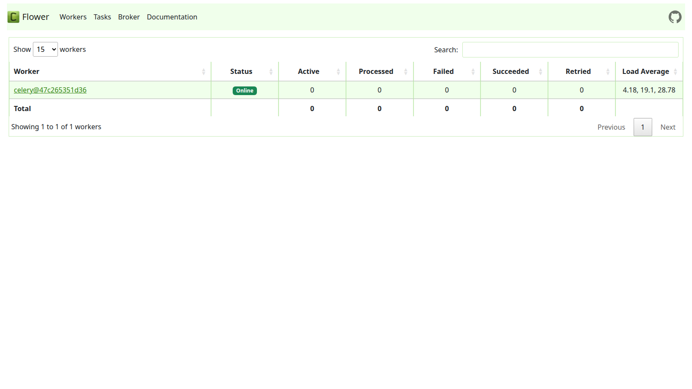
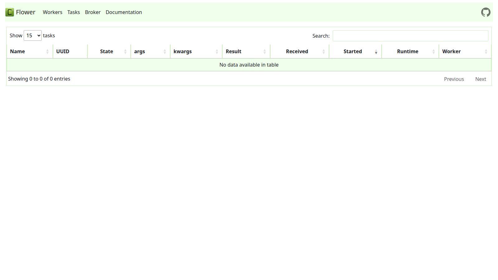

# HW3 – Advanced Weather Pipeline
Builds on HW2. All five cities (Kyiv, Lviv, Odesa, Kharkiv, Ivano-Frankivsk) are
covered with the upgraded requirements below.

---
## Rubric coverage at a glance

| Requirement | Points | Status |
|---|---|---|
| Replace hardcoded values with Jinja templates / DAG params | 20 % | ✅ |
| Cross-DAG dependencies (ingestion → processing) for Kyiv | 30 % | ✅ |
| Factory pattern (one DAG per city) | part of 50 % | ✅ |
| Data quality checks | part of 50 % | ✅ |
| ETL with explicit external storage (raw → transformed → weather) | part of 50 % | ✅ |
| Resume from failed step (idempotent tasks) | part of 50 % | ✅ |
| Celery executor + Flower monitoring screenshot | bonus | ✅ |

---
## Requirements coverage
### (20 %) Jinja templates & DAG params
Every previously hard-coded value is now a **DAG param** passed as an explicit
Jinja-templated argument to each `@task`:

| Param | Default | Task argument |
|-------|---------|---------------|
| `wind_threshold` | `10.0` m/s | `threshold="{{ params.wind_threshold }}"` |
| `units` | `"metric"` | `units="{{ params.units }}"` |
| `lat` / `lon` | city coords | `lat="{{ params.lat }}"`, `lon="{{ params.lon }}"` |
| `min_temp_c` / `max_temp_c` | `-80` / `60` °C | `min_temp="{{ params.min_temp_c }}"` etc. |
| `ds` (logical date) | run date | `logical_date="{{ ds }}"` |

---
### (30 %) Cross-DAG dependencies – Kyiv
Kyiv's pipeline is split into two DAGs:
```
weather_ingestion_dag  ──►  weather_processing_dag
    fetch_and_store_raw         ExternalTaskSensor
                                └─ waits for fetch_and_store_raw
                                ensure_tables
                                transform
                                quality_check
                                branch_wind
                                normal_load / alert_load
```
* `weather_ingestion_dag` – calls OpenWeatherMap, stores raw JSON in
  `pipeline_data.raw_weather`.
* `weather_processing_dag` – starts with an `ExternalTaskSensor`
  (`mode="reschedule"`) that waits for the ingestion DAG's last task to succeed
  before continuing.

---
### (50 %) Design patterns
#### Factory (`weather_city_factory.py`)
`create_weather_dag(city_name, lat, lon)` produces a fully-wired DAG for any
city. It is called for Lviv, Odesa, Kharkiv and Ivano-Frankivsk:
```python
for city, coords in CITIES.items():
    globals()[dag_id] = create_weather_dag(city, coords["lat"], coords["lon"])
```

#### Explicit external storage (ETL with intermediate tables)
```
OpenWeatherMap API
      │  raw JSON
      ▼
pipeline_data.raw_weather          ← extract step writes here
      │  cleaned dict
      ▼
pipeline_data.transformed_weather  ← transform step writes here
      │  quality_passed = TRUE
      ▼
pipeline_data.weather              ← load step writes here
```
Each step reads from the *previous* table and writes to the *next* one.

#### Data quality checks
After transformation a dedicated `quality_check` task validates:
* `min_temp_c ≤ temp_c ≤ max_temp_c`  (bounds from `{{ params.min_temp_c/max_temp_c }}`)
* `0 ≤ humidity ≤ 100`
* `wind_speed ≥ 0`

Failure raises an exception (triggers retries / alert), success marks
`quality_passed = TRUE` in `transformed_weather`.

#### Resume from failed step (idempotency)
Every task checks whether its output row already exists before doing any work:
```python
if hook.get_first("SELECT 1 FROM … WHERE city=%s AND logical_date=%s", …):
    logging.info("already done – skipping")
    return logical_date
```
This means:
* If **extract** succeeds but **transform** fails → re-running from `transform`
  reads directly from `raw_weather` without re-calling the API.
* If **transform** succeeds but **load** fails → re-running from `load` reads
  from `transformed_weather` without re-transforming.

---
## Celery Executor + Flower monitoring

Flower UI running at **http://localhost:5555**

### Dashboard (workers overview)


### Workers tab


### Tasks tab


---
## Infrastructure (same as HW2)
```
docker compose --profile flower up
```
* CeleryExecutor + Redis broker
* PostgreSQL (Airflow metadata + `pipeline_data` schema)
* Flower monitoring UI → http://localhost:5555

---
## Quick start
```bash
cd HW3
echo "WEATHER_API_KEY=<your_key>" >> .env
docker compose up airflow-init
docker compose --profile flower up -d
```
DAGs are paused on creation – unpause them in the UI or via:
```bash
docker compose exec airflow-scheduler airflow dags unpause weather_ingestion_dag
docker compose exec airflow-scheduler airflow dags unpause weather_processing_dag
docker compose exec airflow-scheduler airflow dags unpause weather_lviv
# … etc.
```
