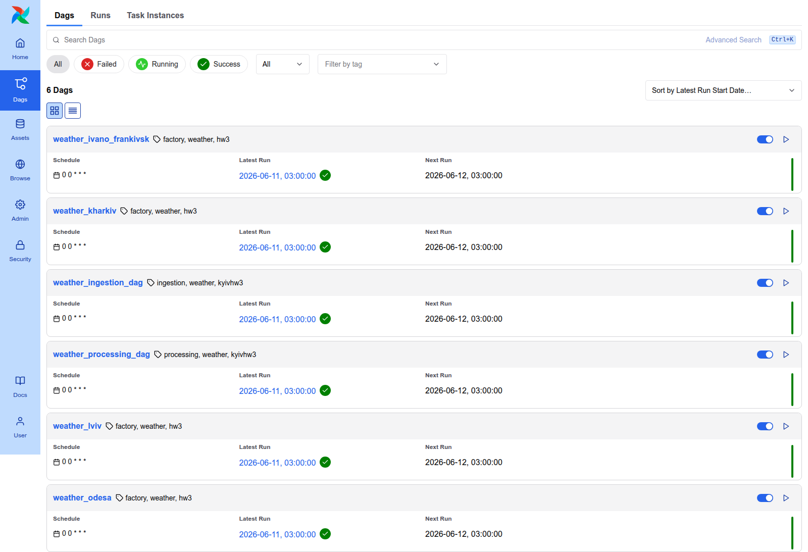
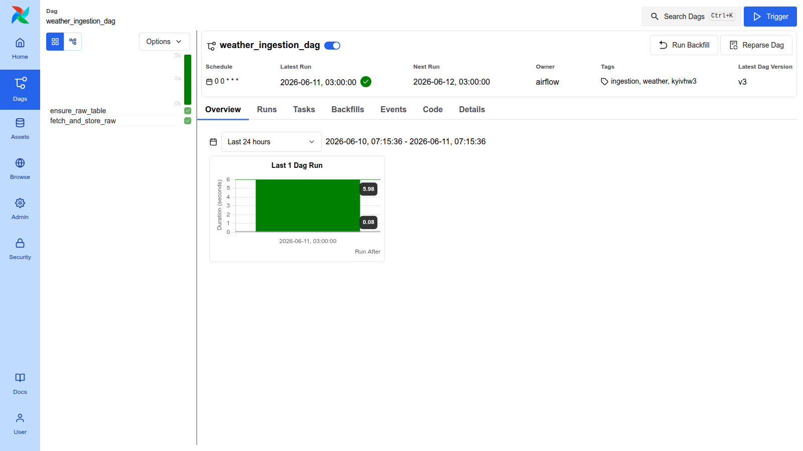
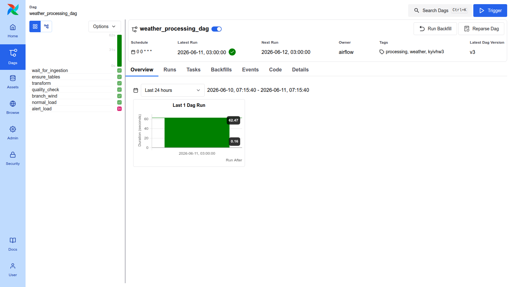
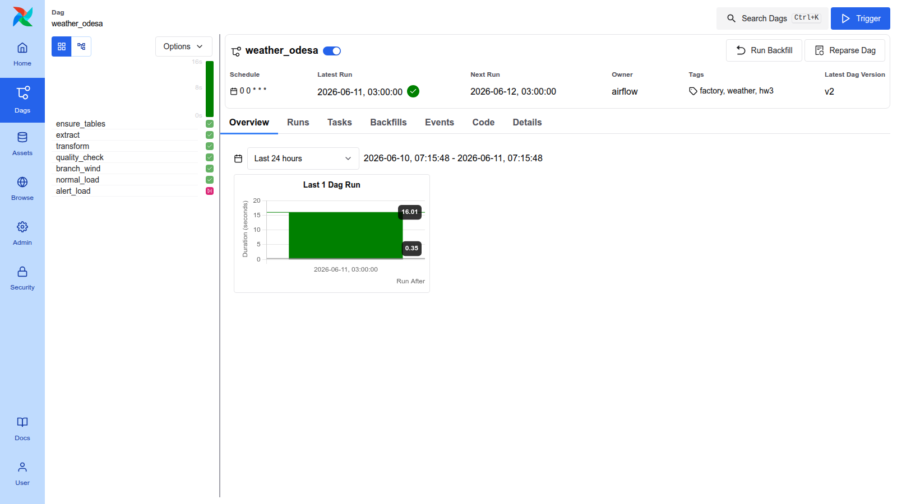
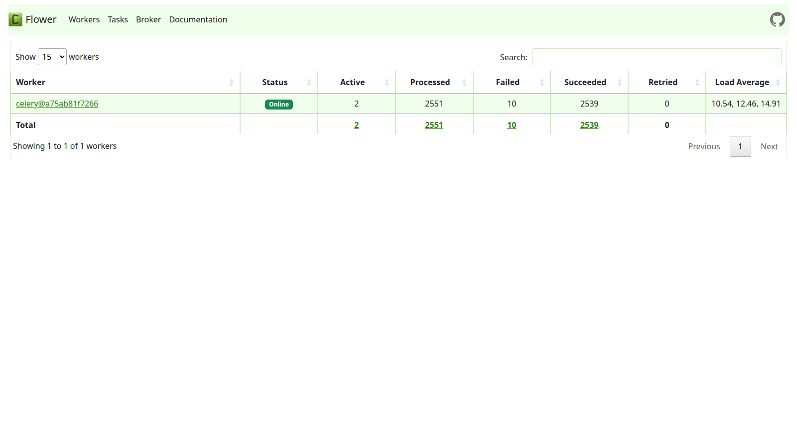
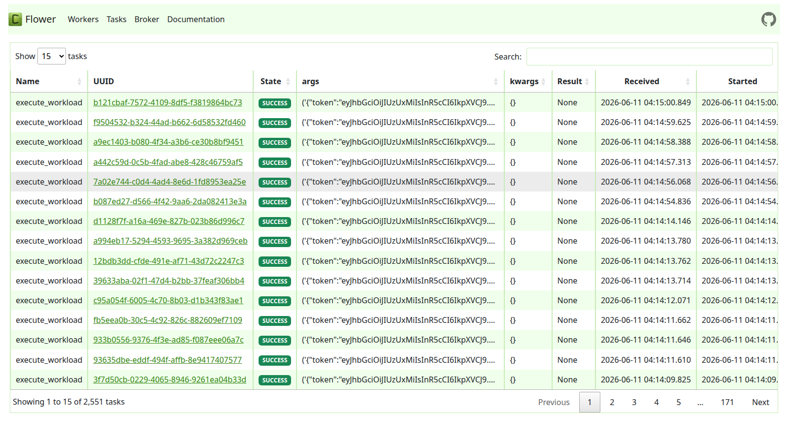

# HW3 — Automated Weather Data Pipeline

Course assignment for "Building Automated Data Pipelines". The goal was to build a production-style Airflow pipeline that fetches historical weather data for Ukrainian cities, stores it in PostgreSQL through staged ETL, and demonstrates key orchestration patterns.

## What was required

| Weight | Requirement |
|--------|-------------|
| 20% | Jinja templates — no hardcoded values in DAG logic |
| 30% | Cross-DAG dependency — one DAG must wait on another |
| 50% | Design patterns — factory, data quality gate, staged ETL, idempotent resume |

## How it was implemented

**Stack:** Apache Airflow 3.0 · PostgreSQL 16 · Redis (Celery) · Docker Compose

### DAGs

Six DAGs run on a daily schedule (`0 0 * * *`):

- `weather_ingestion_dag` — fetches raw Kyiv weather from OpenWeatherMap and stores it as JSONB in `raw_weather`
- `weather_processing_dag` — waits for ingestion via `ExternalTaskSensor`, then transforms, validates, and loads Kyiv data
- `weather_kyiv`, `weather_lviv`, `weather_odesa`, `weather_kharkiv`, `weather_ivano_frankivsk` — generated by a factory function from a single template

### Pipeline stages

```
API call → raw_weather (JSONB) → transformed_weather (JSONB + quality flag) → weather (typed columns)
```

Each stage writes to PostgreSQL before the next reads — no in-memory pass-through. Every task checks for existing output and skips if already done (idempotent).

### Patterns used

- **Factory** — `create_weather_dag(city, lat, lon)` generates all five city DAGs from one definition
- **Jinja params** — temperature bounds, wind threshold, units are all `Param` values rendered at runtime
- **Data quality gate** — validates `temp_c`, `humidity`, and `wind_speed` before final load; raises on failure
- **Wind alert branch** — routes to `alert_load` (sets `alert=TRUE`) or `normal_load` based on wind speed threshold
- **Cross-DAG dependency** — `weather_processing_dag` uses `ExternalTaskSensor` in `reschedule` mode to wait for `weather_ingestion_dag`

## Screenshots

### DAG list — all 6 DAGs running successfully


### Ingestion DAG (Kyiv raw fetch)


### Processing DAG (Kyiv transform + load, waits on ingestion)


### Factory DAG — Lviv


### Factory DAG — Odesa


### Factory DAG — Kharkiv


### Factory DAG — Ivano-Frankivsk


### Celery worker (Flower)


### Celery task history


## Quick start

```bash
cd HW3
echo "WEATHER_API_KEY=<your_key>" >> .env
docker compose up airflow-init
docker compose --profile flower up -d
# UI → http://localhost:8080  (airflow / airflow)
# Flower → http://localhost:5555
```
