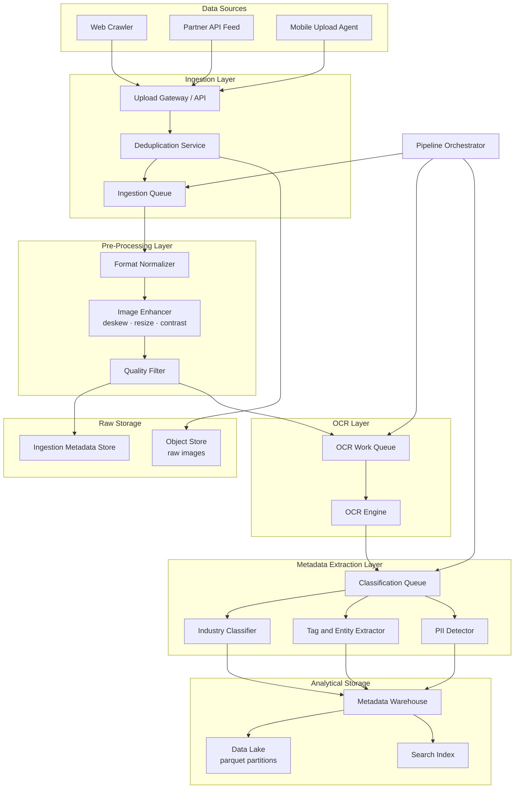
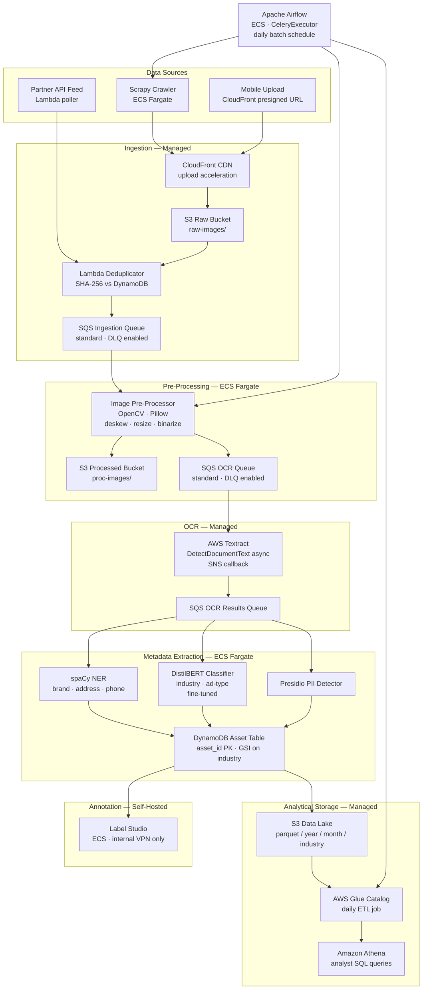

# HW4 — Direct Marketing Creative Intelligence Pipeline
---

## 1. Requirements Analysis

### Assumptions

| Dimension | Assumption |
|-----------|------------|
| **Ingestion volume** | ~500 K images/month (~17 K/day at steady state), with burst peaks up to 3× on campaign launches |
| **Processing volume** | ~200 K images processed through the full pipeline per day (OCR + classification) |
| **Latency** | Batch-oriented — up to 30 minutes end-to-end from ingestion to queryable metadata is acceptable |
| **Sources** | Web crawlers (public ad networks), partner API feeds, field agent mobile uploads |
| **Geography** | Sources distributed across all U.S. regions; single-region storage (us-east-1) with CDN for upload endpoints |
| **Image types** | Print scans (PDF/TIFF), digital display ads (PNG/JPEG/GIF), mailer photos; average 2 MB per raw image |
| **Retention** | Raw images: 3 years; extracted metadata: indefinite |
| **Users** | Internal analysts (~20 concurrent); no public-facing read path required |

### Functional Requirements

- **Ingestion** — Accept image uploads via web crawl, REST API push, and mobile upload; deduplicate by content hash; assign unique asset IDs; tag with source, geography, and timestamp
- **Pre-processing** — Normalize image format (JPEG/PNG), resize to OCR-optimal resolution, apply deskew and contrast enhancement, filter corrupt or duplicate files
- **OCR** — Extract all text content from each image; preserve spatial layout (bounding boxes); handle multi-column layouts and mixed font sizes
- **Metadata extraction** — Classify creative by industry vertical (retail, finance, healthcare, etc.), ad type (coupon, catalogue, direct mail, digital display), sentiment, and detected brand/logo; generate keyword tags
- **Storage** — Persist raw images in object storage; store extracted text, bounding boxes, classifications, and tags in a structured metadata store; support SQL-style analytics queries

### Non-Functional Requirements

| Category | Requirement |
|----------|-------------|
| **Throughput** | Sustain ≥ 200 K images/day processed end-to-end; burst to 500 K/day without architectural changes |
| **Availability** | Pipeline availability ≥ 99.5%; storage availability ≥ 99.9% |
| **Scalability** | All processing stages must scale horizontally; no single-node bottlenecks |
| **Idempotency** | Every stage must be safely re-runnable; re-processing the same image must produce the same output |
| **Security** | Images and metadata encrypted at rest and in transit; access controlled via role-based policies; PII detected and flagged (phone numbers, addresses in ad copy) |
| **Compliance** | CCPA-aware storage; no third-party model training on proprietary ad content without explicit consent |
| **Cost** | Target total pipeline cost ≤ $0.005 per image end-to-end at steady-state volume |
| **Observability** | Per-stage latency, error rate, and throughput metrics; alerting on queue depth and OCR failure rate |

---

## 2. Raw Solution Diagram

Generic component names only — no vendor or technology choices.

---

## 3. Service-by-Service Analysis

### 3.1 Ingestion Pipeline

The ingestion layer must accept images from heterogeneous sources — autonomous crawlers, partner push APIs, and human-held mobile devices — deduplicate them cheaply before expensive processing, and place work onto a durable queue.

#### Open-Source Libraries

**What you get out of the box:**
- **Scrapy** — full HTTP crawling framework with spider scheduling, politeness delays, item pipelines, and proxy middleware
- **httpx** — async HTTP client for API feed polling with connection pooling
- **Pillow** — read and inspect image metadata (dimensions, format, EXIF) for early filtering
- **hashlib** (stdlib) — SHA-256 content hashing for deduplication
- **confluent-kafka-python** — durable, ordered, exactly-once-capable message queue client

**What you still need to build:**
- Cloud object upload wiring (Scrapy item pipeline → object store)
- Mobile upload API (REST endpoint with auth, multipart handling)
- Deduplication state store (a Redis SET of known hashes or a Bloom filter)
- Dead-letter queue handling and retry logic
- Rate-limit handling per source domain

**Operational burden:** High — Scrapy workers need auto-scaling logic under burst load; Kafka cluster requires ongoing management.

**Lock-in risk:** None — all Apache-licensed and portable across clouds.

---

#### 3rd-Party Managed Services

**What you get out of the box:**
- **AWS API Gateway + S3 presigned URLs** — fully managed upload endpoint, TLS termination, auto-scaling to millions of concurrent uploads, built-in CDN edge via CloudFront
- **Amazon SQS** — durable, at-least-once queue with dead-letter queues, visibility timeout, and FIFO option; no cluster to manage
- **AWS Lambda** — serverless deduplication and routing logic triggered by S3 events; scales to zero between bursts

**What you still need to build:**
- Crawler fleet (EC2 or ECS-based Scrapy cluster)
- Mobile client SDK (presigned URL request → upload)
- Deduplication record store (DynamoDB with content hash as PK)

**Operational burden:** Low for the queue and gateway; medium for the crawler fleet.

**Lock-in risk:** Medium — SQS message format and Lambda event schemas are AWS-specific; migrating would require rewriting queue consumers and upload flows.

---

#### Build from Scratch

Justified only if strict on-premises data sovereignty is required (e.g., a government contract where no images may leave private infrastructure). Cost estimate: ~3 engineer-months to build a robust multi-part upload API with resumable uploads, auth, deduplication, and back-pressure. Ongoing operational cost: 1–2 SRE-equivalent days/month.

---

### 3.2 OCR Engine

OCR is the most compute-intensive stage and directly affects downstream data quality. The choice here has the largest impact on both cost and accuracy.

#### Open-Source Libraries

**Tesseract 5 (pytesseract / tesserocr)**

**What you get out of the box:**
- Full OCR pipeline — layout analysis (LSTM engine), bounding-box output in hOCR/TSV/JSON formats
- 100+ language support; Dockerfile-friendly; runs in any container
- Pre-trained LSTM models; custom fine-tuning supported

**What you still need to build:**
- Image pre-processing pipeline (deskew, binarization) — quality degrades badly on skewed or low-contrast scans without it
- Job queue + worker pool (Celery + Redis or Kafka consumers)
- Output normalizer to a canonical JSON schema
- Confidence score filtering and psm mode selection per image type

**Operational burden:** High — Tesseract worker fleet needs auto-scaling; model accuracy on stylized ad fonts requires preprocessing investment.

**Lock-in risk:** None — Apache 2.0 license.

**EasyOCR (PyTorch-based)**

Uses a deep learning backbone (CRAFT + CRNN). Better out-of-box accuracy on curved and stylized text common in advertising copy. Requires GPU instances for practical throughput (>10 img/s per worker); CPU-only is ~10× slower.

---

#### 3rd-Party Managed Services

**AWS Textract**
- Returns structured JSON with blocks (LINE, WORD, TABLE, FORM) and geometry
- Async API (`start_document_analysis` / `get_document_analysis`) fits batch patterns
- Handles PDFs natively; auto-rotates; understands tables and key-value forms
- What you still build: async polling logic or SNS notification handler, confidence threshold filter, cost monitoring

**Google Document AI**
- Offers specialized processors: General OCR, Form Parser, Invoice Parser
- Returns a normalized Document protobuf with token-level confidence scores
- Better on structured forms; comparable to Textract on plain ad copy
- What you still build: batch job coordinator, GCS staging bucket, output schema adapter

**Lock-in risk:** High for both — proprietary APIs, proprietary output schemas, per-page pricing that scales linearly.

---

#### Build from Scratch

Never justified for this use case. Training a competitive scene-text recognizer (CRAFT + CRNN or TrOCR) requires 10M+ labeled examples and months of GPU training. Cost: $200K–$500K in engineering and compute before reaching Textract-level accuracy. Only warranted if you have a proprietary font corpus and need a competitive moat.

---

### 3.3 Metadata Extraction (Classification and Tagging)

This stage turns raw OCR text and the original image into structured business signals: industry vertical, ad type, brand mentions, sentiment, and keyword tags.

#### Open-Source Libraries

**What you get out of the box:**
- **spaCy + custom NER models** — entity extraction (brand names, phone numbers, addresses, product names) from OCR text; trainable on domain-specific corpora
- **HuggingFace Transformers (DistilBERT / RoBERTa)** — zero-shot or fine-tuned text classification for industry vertical and ad type; models available on the Hub
- **CLIP** — joint image-text embeddings for visual similarity search and image-level classification without OCR dependency; Apache 2.0
- **Presidio** (Microsoft) — PII detection and redaction in extracted text (addresses, phone numbers, SSNs); MIT license
- **KeyBERT** — keyword extraction from ad copy for tagging

**What you still need to build:**
- Fine-tuning pipeline on labeled ad examples (cold-start — industry classifier won't work well zero-shot on niche ad categories)
- Model serving infrastructure (Triton Inference Server or TorchServe)
- Label Studio annotation workflow for ground-truth creation
- Feature store for image embeddings (for deduplication and similarity queries)

**Operational burden:** High — model lifecycle management, GPU serving fleet, monitoring for concept drift.

**Lock-in risk:** Low — all Apache/MIT licensed.

---

#### 3rd-Party Managed Services

**What you get out of the box:**
- **AWS Rekognition** — label detection, text detection in images, content moderation, brand logo detection; confidence-scored JSON; no model management
- **Google Vision AI** — label/logo/text detection; strong on brand recognition and safe-search
- **OpenAI GPT-4 Vision API** — classify ad type, extract structured metadata, and generate descriptive tags from image + text in a single prompt; flexible schema via function calling

**What you still need to build:**
- Prompt engineering and output parsing layer (especially for GPT-4V)
- Cost guardrails (GPT-4V at $0.01–0.03/image adds up fast at 200K/day)
- Result normalization across providers

**Operational burden:** Very low — API calls only.

**Lock-in risk:** Medium-to-high — especially OpenAI (proprietary model, pricing changes); Rekognition and Vision AI are somewhat interchangeable at the API level.

---

#### Build from Scratch

Worth building a lightweight fine-tuned classifier (DistilBERT fine-tuned on 10K labeled ad examples) for core industry vertical classification — this is the primary business signal and quality matters. Cost: ~2 engineer-months + $2K–5K GPU compute for training. Inference on CPU is viable at this volume (DistilBERT at ~50ms/sample = ~50 CPU-hours/day for 200K samples).

---

### 3.4 Storage and Data Lake

The storage layer must serve two distinct access patterns: high-throughput analytical queries over metadata (industry breakdown, time trends) and individual asset retrieval by ID or similarity.

#### Open-Source Libraries / Frameworks

**What you get out of the box:**
- **Apache Parquet + Hive partitioning** — columnar format with predicate pushdown; partition by `ingestion_date / industry / state` for efficient range scans
- **Delta Lake** — ACID transactions on Parquet files; time travel; schema enforcement; compaction and Z-ordering for large tables
- **Apache Iceberg** — catalog-agnostic alternative to Delta Lake; better interop with non-Spark engines (Trino, Flink)
- **MinIO** — S3-compatible self-hosted object store for raw images; identical SDK to S3

**What you still need to build:**
- Compaction and vacuum jobs (Delta/Iceberg require periodic maintenance)
- Partition strategy and schema evolution process
- Catalog service (Hive Metastore or Nessie for Iceberg)
- Access control layer (Apache Ranger or Lake Formation policies)

**Operational burden:** Medium-to-high — running a self-managed catalog and compaction scheduler adds operational complexity.

**Lock-in risk:** Low — open standards; Delta Lake files are plain Parquet.

---

#### 3rd-Party Managed Services

**What you get out of the box:**
- **Amazon S3** — 11-nine durability; lifecycle policies for tiering to Glacier; event notifications to Lambda/SQS; native integration with Athena, Glue, and EMR
- **AWS Glue Data Catalog** — managed Hive-compatible catalog; auto-discovery via crawlers
- **Amazon Athena** — serverless SQL on S3 Parquet; $5/TB scanned; no cluster management; ideal for ad-hoc analyst queries at this scale
- **Amazon DynamoDB** — managed key-value store for per-image metadata record (asset ID → OCR text, classifications, tags, S3 path); single-digit ms reads; auto-scaling

**What you still need to build:**
- Glue ETL jobs or custom Spark scripts to convert raw JSON → Parquet
- Partition projection config in Athena for performance
- Data retention lifecycle policies

**Operational burden:** Low — no servers to manage.

**Lock-in risk:** Medium — Athena SQL dialect and Glue catalog are AWS-specific; using Iceberg table format would mitigate.

---

#### Build from Scratch

Building raw object storage from scratch is never justified. A custom metadata store (replacing DynamoDB/Athena) only makes sense if you need sub-100ms query latency on complex graph relationships — in that case, a graph database (Neo4j) or a dedicated vector store (Qdrant) for CLIP embedding similarity search is worth adding as a sidecar, not a replacement.

---

## 4. OCR Service Comparison

**Scale for this comparison:** 200,000 images/day · 6,000,000 images/month · average 2 MB/image · 1 page per image.

| Dimension | Tesseract 5 (self-hosted) | AWS Textract | Google Document AI |
|-----------|--------------------------|--------------|-------------------|
| **Pricing model** | Compute only — no per-image fee | Per-page: $0.0015 (DetectText), $0.015 (AnalyzeDocument) | Per-page: $0.0015 (OCR), $0.065 (Form Parser) |
| **Est. monthly cost @ 6 M images** | c6i.4xlarge × 20 workers ≈ $4,500 + $600 S3 = **~$5,100** | DetectText only: **~$9,000** — AnalyzeDocument: **~$90,000** | OCR only: **~$9,000** — Form Parser: **~$390,000** |
| **Accuracy — print ads** | 85–92% word accuracy after pre-processing | 95–99% word accuracy; strong on degraded scans | 94–98% word accuracy; excellent on structured forms |
| **Accuracy — stylized/display fonts** | 60–80% — degrades on decorative fonts | 88–94% — LSTM handles font variation well | 87–93% — comparable to Textract |
| **Output format** | hOCR, TSV, JSON (custom) | Structured JSON with Block / Geometry / Relationship | Document protobuf → JSON; token + page level |
| **Bounding boxes** | Yes — word, line, paragraph level | Yes — WORD, LINE, TABLE, CELL, KEY_VALUE_SET | Yes — token, paragraph, block, table level |
| **PDF / multi-page native** | No — requires pdf2image pre-processing | Yes — native async PDF up to 3,000 pages | Yes — native PDF; GCS staging required |
| **Table and form extraction** | No structured table extraction | Yes — AnalyzeDocument with TABLES/FORMS feature | Yes — Form Parser processor |
| **Async / batch API** | N/A — you implement the queue | Yes — StartDocumentAnalysis + SNS callback | Yes — batch_process_documents API |
| **Auto-rotation / deskew** | No — must pre-process externally | Yes — automatic | Yes — automatic |
| **GPU required for throughput** | No (LSTM, CPU-viable) | N/A (managed) | N/A (managed) |
| **Custom model training** | Yes — full retraining supported | No | Yes — AutoML-based custom processor |
| **Data privacy** | Full control — data stays in your VPC | Data sent to AWS; no model training on your data; BAA available | Data sent to Google; DPA available; no model training |
| **Compliance (HIPAA / SOC2)** | Self-managed; your responsibility | HIPAA BAA available; SOC2 Type II | HIPAA BAA available; SOC2 Type II |
| **Operational burden** | High — worker fleet, auto-scaling, monitoring | Low — API + async polling | Low — API + GCS staging |
| **Setup time** | 2–4 weeks (infra + pre-processing pipeline) | 1–3 days (API integration) | 1–3 days (API + GCS setup) |
| **Lock-in risk** | None | High — proprietary API and output schema | High — proprietary API and output schema |
| **Advantages** | No per-image cost; full data control; customizable | Best accuracy on degraded scans; native PDF; managed at scale | Best structured form extraction; strong multilingual |
| **Disadvantages** | Requires pre-processing; lower accuracy on stylized fonts; high operational overhead | Cost scales linearly — ~2× more expensive than self-hosted at scale; vendor lock-in | GCS staging adds friction; significantly higher cost for form parsing |

### Recommendation

**Use AWS Textract for the OCR stage.**

At 200K images/day the cost of Textract's `DetectDocumentText` API is ~$300/day ($9,000/month) versus ~$170/day ($5,100/month) for a well-tuned self-hosted Tesseract fleet. The ~$4,000/month premium buys:

1. **5–10 percentage points better word accuracy** on real-world ad scans — which directly improves downstream classification quality and reduces manual labeling correction costs
2. **Zero pre-processing pipeline** — Textract handles rotation, skew, and degraded scans natively; eliminating the pre-processing engineer-months pays back the cost difference in year one
3. **Native PDF and async batch API** — matches the 30-minute batch latency requirement with no queue architecture overhead
4. **SOC2/HIPAA compliance included** — critical if any ad content touches regulated industries (healthcare, finance), which is exactly the target domain

Google Document AI is the best alternative if structured form/table extraction becomes a primary requirement (e.g., catalogues with pricing grids). For plain ad copy OCR, Textract's async API integration is simpler and its AWS ecosystem fit is a significant advantage given the rest of the stack.

Tesseract remains the right choice only if budget constraints make the $4K/month premium untenable or if data must never leave a private network. In that scenario, invest 3–4 weeks in the pre-processing pipeline (OpenCV deskew + binarization + contrast enhancement) to close the accuracy gap.

---

## 5. Final Architecture Diagram

**Stack:** Apache Airflow · AWS S3 · Amazon SQS · AWS Textract · AWS Lambda · Amazon ECS Fargate · AWS Glue · Amazon Athena · Amazon DynamoDB · CloudFront · Label Studio · HuggingFace DistilBERT · spaCy · Microsoft Presidio · OpenCV · Pillow · Python 3.12

### Technology Choices — Justifications

| Component | Technology | Managed / Self-Hosted | Justification |
|-----------|-----------|----------------------|---------------|
| **Raw + processed image storage** | Amazon S3 | Managed | 11-nine durability; S3 event triggers feed SQS natively; lifecycle policies handle 3-year retention tiering to Glacier — traceable to NFR: availability ≥ 99.9% |
| **Upload acceleration** | CloudFront presigned URL | Managed | Edge-accelerates mobile uploads from all U.S. regions to single-region S3 — traceable to assumption: global sources, single-region storage |
| **Web crawling** | Scrapy on ECS Fargate | Self-hosted | No managed SaaS matches customization needed for per-domain politeness rules on ad networks; ECS Fargate removes server management — traceable to FR: ingestion |
| **Deduplication** | AWS Lambda + DynamoDB | Managed | SHA-256 lookup against DynamoDB in single-digit ms on S3 PUT event; scales to zero between bursts; eliminates duplicate work before any paid processing — traceable to NFR: cost |
| **Message queues** | Amazon SQS | Managed | At-least-once delivery, configurable DLQ, no cluster management; decouples all processing stages — traceable to NFR: horizontal scalability |
| **Image pre-processing** | OpenCV · Pillow on ECS Fargate | Self-hosted | Open-source, standard libraries; deskew and binarize before Textract to improve accuracy on worst-case scans; Fargate auto-scales on SQS queue depth — traceable to FR: pre-processing |
| **OCR engine** | AWS Textract | Managed | Best accuracy on degraded ad scans (see §4); async API fits 30-min latency NFR; native PDF; SOC2/HIPAA compliant — traceable to FR: OCR and NFR: compliance |
| **NER / entity extraction** | spaCy + custom NER | Self-hosted | Extracts brand names, addresses, phone numbers from ad copy; trainable on domain corpus; Apache 2.0; no per-call cost — traceable to FR: metadata extraction |
| **Industry / ad-type classifier** | HuggingFace DistilBERT (fine-tuned) | Self-hosted | Core business signal; fine-tuned on labeled ad examples for precision; CPU-viable at 200K/day — traceable to FR: metadata extraction |
| **PII detection** | Microsoft Presidio | Self-hosted | Detects addresses, phone numbers, SSNs in extracted text; MIT license — traceable to NFR: security/compliance |
| **Per-asset metadata store** | Amazon DynamoDB | Managed | Sub-10ms reads on asset_id; GSIs enable industry/date range queries; auto-scaling — traceable to FR: storage, NFR: throughput |
| **Data lake** | S3 + Apache Parquet | Managed (S3) + open format | Columnar Parquet with Hive partitioning enables efficient Athena predicate pushdown; open format avoids lock-in — traceable to NFR: scalability, cost |
| **Data catalog** | AWS Glue Data Catalog | Managed | Hive-compatible; natively queried by Athena; auto-crawler discovers new partitions; daily Glue ETL job converts DynamoDB exports to Parquet — traceable to FR: storage |
| **Analyst query layer** | Amazon Athena | Managed | Serverless SQL on S3; $5/TB scanned; no cluster — traceable to NFR: cost ≤ $0.005/image |
| **Annotation platform** | Label Studio | Self-hosted (ECS) | Apache 2.0; supports image + text labeling; feeds fine-tuning data back to classifier; deployed inside VPN so raw images never leave the account — traceable to NFR: security |
| **Pipeline orchestration** | Apache Airflow (CeleryExecutor on ECS) | Self-hosted | DAGs encode the daily batch schedule, inter-stage dependencies, retry/DLQ re-processing logic, and idempotent task design — traceable to NFR: idempotency, availability |
